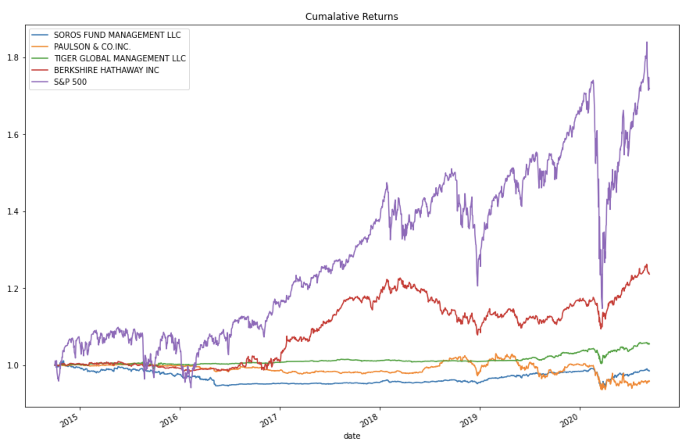

# Risk-Return Analysis 

Comparing four portfolios(*Soros Fund Management LLC*, *Paulson & CO.Inc.*, *Tiger Global Management LLC*, *Berkshire Hathway Inc.*) to the market from 2014 through 2021. The analysis includes **the performance, volitility, and risk** of all four portfolios.

---

## Technologies

Python version 3.9 
* [Jupyter Notebook](https://jupyter.org/) - Interactive computing with python
* [numpy](https://numpy.org/) - For some computations
* [pandas](https://pandas.pydata.org/) - To read, calculate, analysis, visualize data
* [pathlib](https://docs.python.org/3/library/pathlib.html) - Dynamic path finder
* [matplotlib](https://matplotlib.org/) - To visualize the data

---


## Installation Guide

To install the dependencies used for this application, enter the following into your terminal.
```python
pip install numpy
pip install pandas
pip install pathlib
pip install matplotlib
```

---

## Usage 

The notebook is great for visuallizing what risk-return analysis would look like. This is not a form a fanacial advice but an example that could be studied for self practice. Here is a demo of what someone will see in the notebook.


---

## Contributors

Main contributer **Santiago Hernandez**
- [dsmannight@gmail.com](dsmannight@gmail.com)

---

## License

This application is free for non-profit use.
